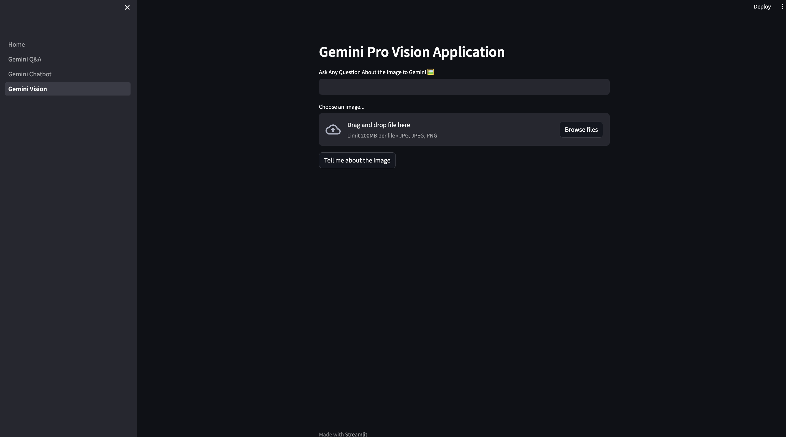
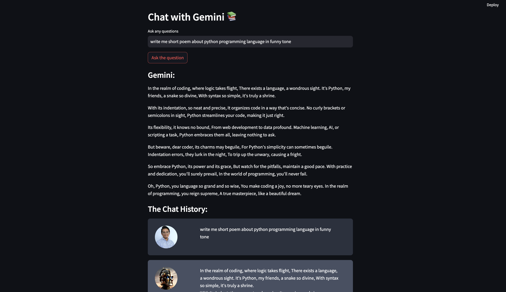
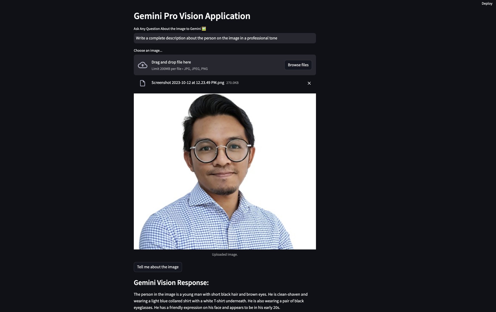

# CHATBOT & VISION USING GOOGLE GEMINI



This project involve 3 differents application in LLM Application using Google Gemini Pro API with user interface using Streamlit.

1. Gemini Question & Answer Application

   - Application: You can ask any questions, Gemini will response with an answer.

2. Gemini Chat Bot

   - Application: You can ask any questions and interact with Gemini. Every chat conversation will be stored in a history.
     

3. Gemini Vision
   - Application: You can upload a picture and any questions related to the picture.
     

# HOW TO RUN THE PROJECT

## STEP 1: Setup Local Project Environment

Using conda to create new environment and activate the environment.

### Create Conda Environment

```
conda create --name ENV_NAME python==3.10
```

### Activate Conda Environment

```
conda activate ENV_NAME
```

## STEP 2: Install Requirements

Install environment requirements

```
pip install -r requirements.txt
```

## STEP 3: Update .env

Create .env file and insert your own private google api key.

```
GOOGLE_API_KEY=""
```

## STEP 4: Run the Application

### Gemini Question & Answer Application

```
streamlit run gemini_qa.py
```

### Gemini Chat Bot

```
streamlit run gemini_chat.py
```

### Gemini Vision

```
streamlit run gemini_vision.py
```

# SOURCE

1.  [Google Gemini Documentation](https://ai.google.dev/tutorials/python_quickstart#chat_conversations)
